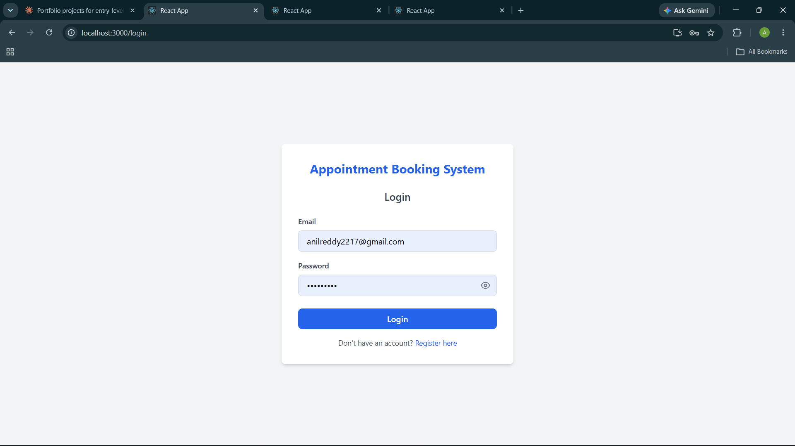
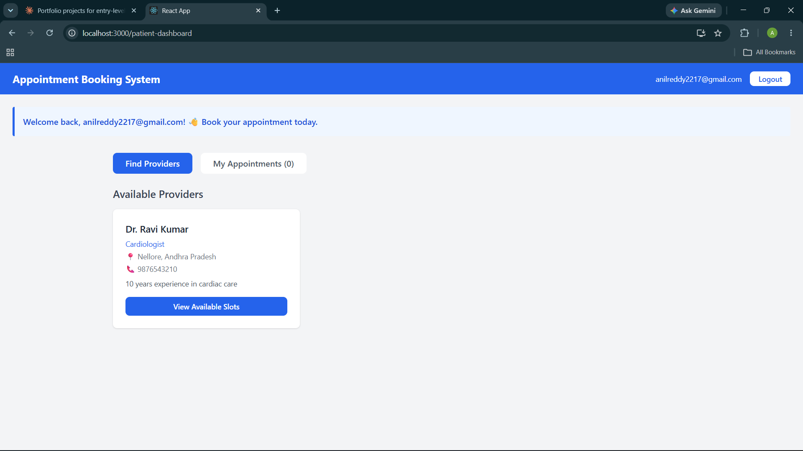
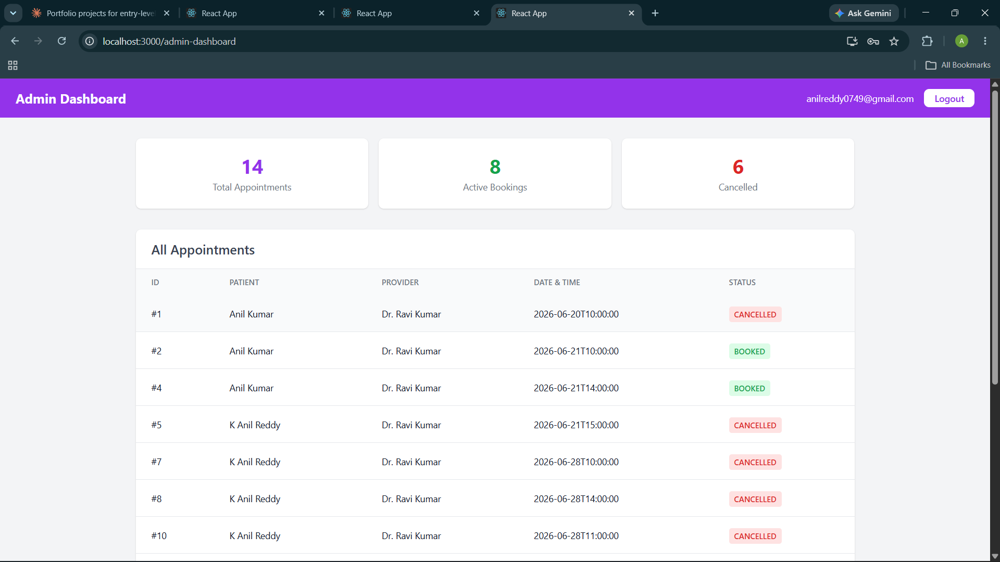
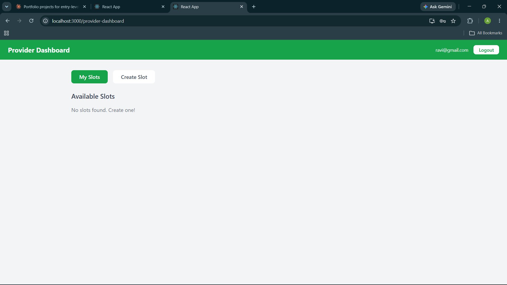

# Appointment Booking System

A full-stack web application for booking appointments between patients and service providers.

## Screenshots

### Login Page


### Patient Dashboard


### Admin Dashboard


### Provider Dashboard


## Tech Stack

**Backend:** Java 24, Spring Boot 4.0.7, Spring Security, Spring Data JPA, Hibernate
**Frontend:** React 18, Tailwind CSS, Axios
**Database:** MySQL 8.0
**Tools:** Maven, Postman, IntelliJ IDEA, VS Code

## Features

- User registration and login with JWT authentication
- Role based access control — Admin, Provider, Patient
- Provider profile and slot management
- Appointment booking and cancellation
- Email confirmation and 24hr reminder notifications
- PDF appointment receipt generation
- Search providers by specialty
- Filter slots by date
- Admin dashboard with analytics
- Unit tests with JUnit 5 and Mockito

## Getting Started

### Prerequisites
- Java 17+
- MySQL 8.0
- Maven 3.9+
- Node.js 24 LTS

### Backend Setup

1. Clone the repository
```bash
   git clone https://github.com/anilreddy2217/appointment-booking-system.git
```

2. Create MySQL database
```sql
   CREATE DATABASE appointment_db;
```

3. Create `src/main/resources/application.properties`
```properties
   spring.datasource.url=jdbc:mysql://localhost:3306/appointment_db
   spring.datasource.username=root
   spring.datasource.password=yourpassword
   spring.jpa.hibernate.ddl-auto=update
   spring.jpa.show-sql=true
   spring.mail.host=smtp.gmail.com
   spring.mail.port=587
   spring.mail.username=${MAIL_USERNAME}
   spring.mail.password=${MAIL_PASSWORD}
   spring.mail.properties.mail.smtp.auth=true
   spring.mail.properties.mail.smtp.starttls.enable=true
   spring.jpa.open-in-view=false
```

4. Run the application
```bash
   mvn spring-boot:run
```

5. API runs on `http://localhost:8080`

### Frontend Setup

1. Navigate to frontend folder
```bash
   cd booking-frontend
```

2. Install dependencies
```bash
   npm install
```

3. Start the app
```bash
   npm start
```

4. App runs on `http://localhost:3000`

## API Endpoints

| Method | Endpoint | Description |
|--------|----------|-------------|
| POST | /api/auth/register | Register a new user |
| POST | /api/auth/login | Login and get JWT token |
| POST | /api/providers/profile | Create provider profile |
| GET | /api/providers/all | Get all providers |
| GET | /api/providers/search | Search by specialty |
| POST | /api/slots/create | Create a slot |
| GET | /api/slots/available/{id} | Get available slots |
| POST | /api/appointments/book | Book an appointment |
| PUT | /api/appointments/cancel/{id} | Cancel appointment |
| GET | /api/appointments/my/{id} | Get patient appointments |
| GET | /api/appointments/receipt/{id} | Download PDF receipt |
| GET | /api/appointments/all | Get all appointments (Admin) |

## Project Structure

    src/main/java/com/appointment/booking_system/
    ├── controller/     # REST API endpoints
    ├── service/        # Business logic
    ├── repository/     # Database queries
    ├── model/          # Entity classes
    ├── dto/            # Request/Response objects
    ├── security/       # JWT and Spring Security
    └── exception/      # Global error handling

## Author

K Anil Reddy
[GitHub](https://github.com/anilreddy2217)